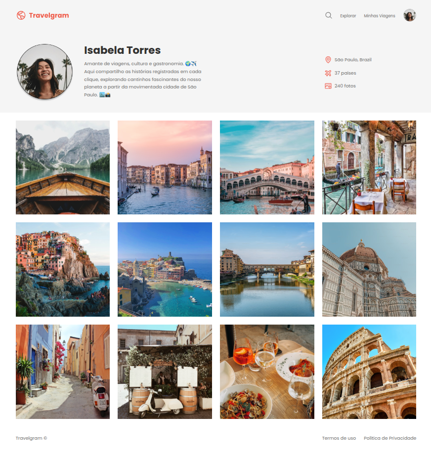

# Travelgram

Pequeno projeto front-end que apresenta um perfil de viagens (Travelgram) e uma galeria de imagens. Feito como exercício de layout com HTML e CSS.

## Visão geral

O projeto contém uma página estática (`index.html`) que usa CSS modularizado na pasta `styles/` e ativos em `assets/`. A estrutura demonstra um cabeçalho com informações do usuário, uma galeria de fotos em `main` e um rodapé simples.

Principais características:

- Layout responsivo básico usando classes utilitárias e variáveis CSS (no arquivo `styles/index.css`).
- Cabeçalho com logo, menu primário e um bloco de perfil com foto, nome e estatísticas.
- Galeria de imagens simples no `main`.

## Estrutura do projeto

```
Travelgram/
├─ index.html           # Página principal
├─ README.md            # Este arquivo
├─ assets/              # Imagens e ícones usados no layout
├─ styles/              # Arquivos CSS
   ├─ global.css
   ├─ header.css
   ├─ index.css
   ├─ main.css
   ├─ nav.css
   └─ footer.css
```

## Como abrir (modo desenvolvimento)

1. Abra o diretório do projeto no seu editor/IDE preferido.
2. Abra `index.html` no navegador (duplo clique ou `File → Open File`).

Alternativa com servidor local (recomendado para evitar problemas de caminho de arquivos): utilise o live server

## Screenshot


